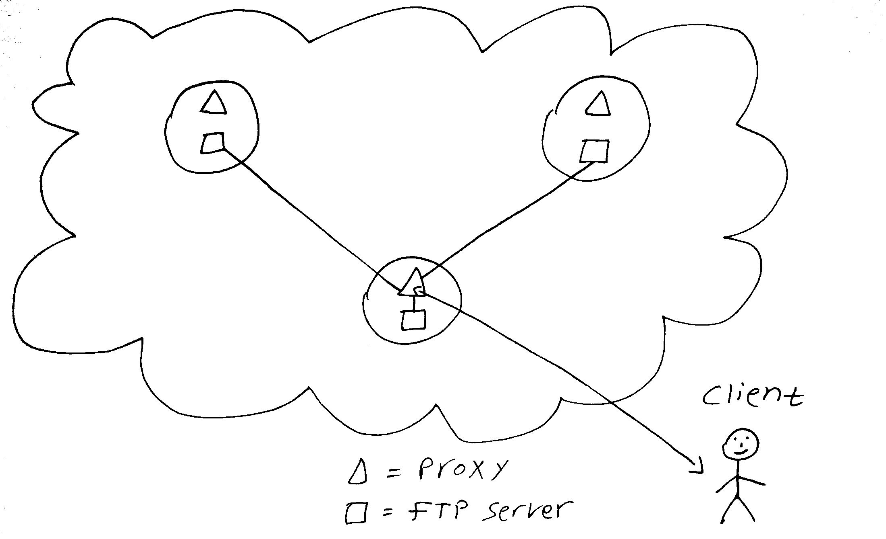

## Protocol overview
A "Cloudroid" server consists of 2 processes running together:  
<li>FTP server - Taken from the pyftpdlib library.  
<li>Proxy server - Implemented by us.  
The FTP server works in the background while the proxy server works in the front. The proxy accepts clients connections, broadcasts traffic to the network, and multiplexes replies to the client. 
When a client connection is made, the proxy server connects to all FTP servers on the network. These servers are listed in the file PEERS.txt. 
Therefore, the network can be diagrammed as follows:

It should be noted that connections between proxy servers and FTP servers(or equivalently: between FTP clients and FTP servers), actually consist of 2 different connections: 
<li>Control connection. 
<li>Data connection. 
This is a inherent part of the FTP protocol that the proxy server must take care of. 
The control connection is used to send FTP commands and recieve return codes, while the data connection is used to send and recieve data(e.g: when sending files). 
Data connections are opened for client requests and they are disposable. For each session, many data connections might be opened and closed, but the control connection remain. 
The proxy server deals with it by creating data connection with all FTP servers in the network except of the local FTP server. The data connection of the local FTP server is redirected back to the client. 
Therefore, when the client exchanges data with the network, he actually exchanges it with one server only. When he finishes, the proxy server uses it's own data connections with other servers to broadcast 
the data to the network. 

Another important aspect of the protocol is a consistency check procedure that runs every time a new session with client begins. 
This procedure ensures that the files in the shared directory of one server will be the same files in the shared directory of other servers in the network. 
To decide if a server is consistent or not, a special parameter named CONSISTENCY_THRESHOLD is defined. It is a number between 0 to 1, that gives the percentile of servers allowed to differ 
from the server under check.
The consistency check procedure is using hashes of files(that get stored in the ServerHash.txt file) to compare them. 

